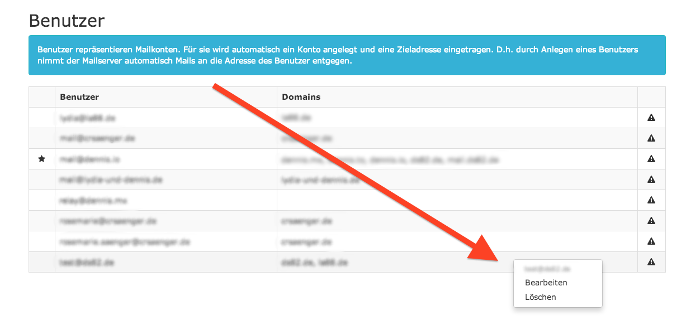

# ng-contextmenu

[bootstrap]: http://getbootstrap.com
[angular]: http://angularjs.org

> A [bootstrap] contextmenu for [angular] based apps

A lot of web projects use bootstrap together with angular. My project actually all do.
With this simple angular module you can use bootstrap's dropdown menu's as
contextmenu's menu on various elements (e.g. tables).



## How to use

 * get the contextmenu.js file
 * make it available in your code
 * make angular load the module:
```js
var app = angular.module('app', [
  'ngResource',
  'ngRoute',
  'io.dennis.contextmenu'
]);
```
 * define the contextmenu in your template
```html
<!-- contextmenu -->
<div contextmenu="meta.contextmenu" class="dropdown contextmenu">
  <ul class="dropdown-menu" role="menu">
    <li class="dropdown-header">
      {{ meta.contextmenu.$item.email }}
    </li>
    <li>
      <a role="menuitem" tabindex="-1" href
         ng-href="#/user/{{ meta.contextmenu.$item.email }}/edit"
      >
        <span>Edit</span>
      </a>
    </li>
    <li>
      <a role="menuitem" href 
        ng-click="delete( meta.contextmenu.$item )"
      >
        <span>Delete</span>
      </a>
    </li>
  </ul>
</div>
```
 * link it to your html element
```html
<table class="table" contextmenu-container="meta.contextmenu">
  <tr>
    <th>&nbsp;</th>
    <th>User</th>
    <th>Domains</th>
    <th>&nbsp;</th>
  </tr>
  <tr ng-repeat="row in data" contextmenu-item="row">
    <td class="col-center">
      <span class="fa fa-star" ng-show="row.is_admin" />
    </td>
    <td>{{row.email}}</td>
    <td>{{row.domains.join(', ')}}</td>
    <td class="col-center">
      <span class="fa fa-warning" ng-show="!user.maildirCheck.isMaildir" />
    </td>
  </tr>
</table>
```